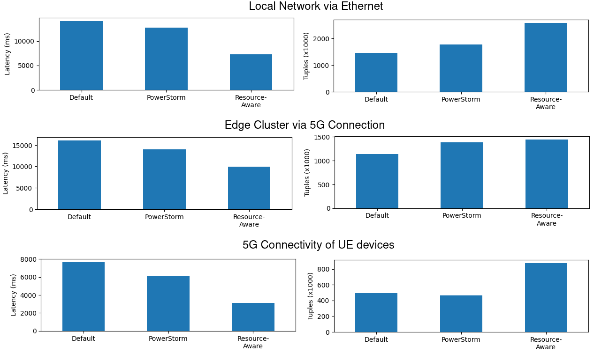

# 6G-SANDBOX-PowerStorm
The PowerStorm Framework, built on top of Apache Storm, aims to optimize the performance and energy efficiency of underlying infrastructures by strategically assigning streaming analytic job operators to worker nodes.

For this project, we've purchased seven UE devices to showcase the usability of our scheduler, namely, three Raspberry Pi 5, two Jetson Nano, one Jetson NX Xavier, and one Jetson AGX Orin. For each UE device, we have also used the appropriate 5G toolkit.

For the experiments, we have utilzed a monitoring system that includes technologies such as [Netdata](https://www.netdata.cloud/?utm_term=netdata&utm_campaign=&utm_source=adwords&utm_medium=ppc&hsa_acc=1994805325&hsa_cam=21224984326&hsa_grp=161333239573&hsa_ad=697502229587&hsa_src=g&hsa_tgt=kwd-307696195113&hsa_kw=netdata&hsa_mt=e&hsa_net=adwords&hsa_ver=3&gad_source=1&gclid=CjwKCAiA0rW6BhAcEiwAQH28IiNLgv1FwoMAvxVbheRbSid7lCMZKSJ5MeJzr-k3t2areJwrGNYhvRoCvNQQAvD_BwE), [Cadvisor](https://github.com/google/cadvisor), [Prometheus](https://prometheus.io/) and [Consul](https://www.consul.io/), as to automatically capture and store both utilization and power consumption metrics.

# Results

To conduct our experiments, we utilized Berlin’s testbed and introduced our 5G-enabled compute nodes, creating three distinct setups. As our baseline, we connected the edge compute nodes to a local router via Ethernet and conducted the initial set of experiments using this configuration. Next, we used three virtual machines (VMs) provided by Pilot. Two of these, VM-Big-0 and VM-Big-1, were equipped with 16 GB of RAM and hosted on separate servers, while the third, VM-Small-0, with 8 GB of RAM, was collocated with VM-Big-1. On this cluster, we executed the Apache Storm analytical pipeline, generating workloads (tuples) through a user equipment (UE) device connected to the 5G network. Finally, we connected all of our 5G-enabled UE devices to Berlin’s RAN and repeated the trials over the 5G network to assess performance under these conditions.

   
    Figure 1: Latency & Tuples Comparison for Local Ethernet, 5G Edge Cluster, and UE Devices.

 

The figure above presents the application-level performance metrics, specifically end-to-end latency and the total number of processed tuples, across our three experimental setups. Notably, PowerStorm outperformed other configurations in all cases, with the Resource-Aware scheduler proving to be the most effective in terms of performance. Examining the network characteristics, we observe that a local connection via Ethernet yields slightly better performance compared to execution on the Edge Cluster. However, this difference is minor, considering that in the Ethernet setup, data generators are collocated with the devices, whereas in the Edge Cluster setup, data must traverse the 5G network. The most significant finding from our experiments is that deploying UE compute devices with 5G network connectivity surpasses the performance of Ethernet connections, demonstrating the high quality and robust QoS offered by 5G radio access networks.

In terms of energy consumption within the local network (ethernet), both PowerStorm and Resource-aware execution demonstrated a reduction in energy use, with decreases of approximately 15% and 5.9% respectively. These results align with our initial expectations based on preliminary trials. Next, we analyzed energy consumption during the Edge Cluster execution, involving 5G data generation. In this scenario, PowerStorm resulted in a 13.2% increase in energy consumption, while the Resource-aware scheduler exhibited a more substantial rise of 135.9%. Despite the increased energy demands, both approaches provided superior performance in latency reduction and overall tuples processed, illustrating the trade-off between energy efficiency and performance gains in this setting. Finally, we compared the energy consumption across three configurations, namely, the default execution of Apache Storm, the PowerStorm-enabled deployment, and the resource-aware deployment, in the 5G RAN network. In this comparison, PowerStorm showed a minimal energy increase of just 0.43%, whereas the Resource-aware scheduler nearly doubled the system's energy consumption, with an increase of 93.7%. 

When comparing the results across different deployments (Ethernet, 5G-Edge, and 5G-RAN), we observed several noteworthy findings. The Edge cluster proved to be the most power-intensive, primarily due to the use of conventional server hardware. In terms of energy consumption, there was little difference between devices connected via Ethernet and those connected via 5G. However, executing our workload over the 5G network significantly enhanced performance. 

To this end, our experiments and analyses demonstrate that modern big data streaming engines are well-suited for operation on 5G networks. Running these engines on 5G networks offers performance benefits comparable to those of Ethernet connectivity. Furthermore, deploying 5G-enabled User Equipment (UE) devices with processing capabilities enhances both performance and energy efficiency, as evidenced by our experimental results.

# Datasets
Our datasets can be found under the `/datasets` folder. Inside, one can find the `summary` and `raw` folders. As their name implies, we include both the raw datasets that include the collected utilization and application measurements, whilst, the summary includes their summarized information.

# Code  
Under `/storm` we include the Apache Storm 2.2.0 binaries and code, including our PowerStorm scheduler.

# Workload & Configurations
For these experiments, we have employed the widely known [Yahoo Streaming Benchmark](https://github.com/yahoo/streaming-benchmarks), which is designed to simulate a data processing pipeline for extracting insights from marketing campaigns. The pipeline executed on the worker device includes steps such as receiving advertising traffic data, filtering the data, removing any unnecessary values, combining the data with existing information from a key-value store, and storing the final results. All data produced by a data generator is pushed and extracted through a message queue ([Apache Kafka](https://kafka.apache.org/)), while intermediate data and final results are stored in an in-memory database ([Redis](https://redis.io/)).
This workload can be executed using [Apache Storm](https://storm.apache.org/).

For evaluating <strong>the performance of this application</strong>, we extract the following measurements from the benchmarking log files:
<table>
  <tr align="center" style="border-bottom: 0.5px solid grey">
    <th style="border-right: 1px solid white; border-bottom: 0.5px solid white">Metric</th>
    <th style="border-bottom: 0.5px solid white">Description</th>
  <tr>
    <td><strong># of Tuples</strong></td>
    <td>The total number of tuples processed during execution</td>
  </tr>
  <tr>
    <td><strong>Latency</strong></td>
    <td>The total application latency, measured in ms, based on the statistics provided by Apache Storm for each deployed task</td>
  </tr>
</table

In regards to the application parameters we used the following ones:

<table>
  <tr align="center" style="border-bottom: 0.5px solid grey">
    <th style="border-bottom: 0.5px solid white">Application Parameters</th>
  <tr>
    <td><ul><li><i>campaigns: 100000</i>, which is the number of campaigns.</li><li><i>tuples_per_second: 1000000</i>, which is the number of emitted tuples per second.</li> <li><i>kafka_event_count: 100000000</i>, the number of generated and published events on kafka</li></ul></td>
  </tr>
</table>