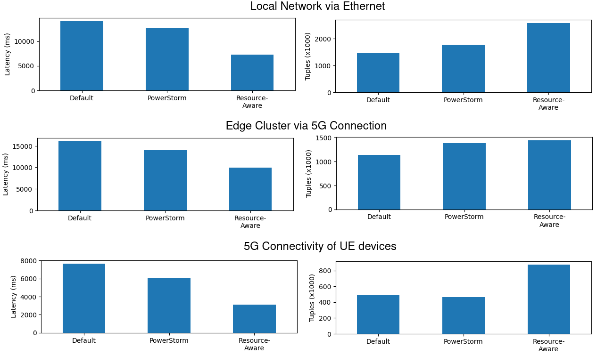

# 6G-SANDBOX-PowerStorm
The PowerStorm Framework, built on top of Apache Storm, aims to optimize the performance and energy efficiency of underlying infrastructures by strategically assigning streaming analytic job operators to worker nodes.

For this project, we've purchased seven UE (User Equipment) devices to showcase the usability of our scheduler, namely, three Raspberry Pi 5, two Jetson Nano, one Jetson NX Xavier, and one Jetson AGX Orin. For each UE device, we have also used the appropriate 5G toolkit.

For the extraction of monitoring measurements we have utilized the following technologies: [Netdata](https://www.netdata.cloud/?utm_term=netdata&utm_campaign=&utm_source=adwords&utm_medium=ppc&hsa_acc=1994805325&hsa_cam=21224984326&hsa_grp=161333239573&hsa_ad=697502229587&hsa_src=g&hsa_tgt=kwd-307696195113&hsa_kw=netdata&hsa_mt=e&hsa_net=adwords&hsa_ver=3&gad_source=1&gclid=CjwKCAiA0rW6BhAcEiwAQH28IiNLgv1FwoMAvxVbheRbSid7lCMZKSJ5MeJzr-k3t2areJwrGNYhvRoCvNQQAvD_BwE), [Cadvisor](https://github.com/google/cadvisor), [Prometheus](https://prometheus.io/) and [Consul](https://www.consul.io/), as to automatically capture and store both utilization and power consumption metrics.

# Results

To conduct our experiments, we leveraged Berlin's testbed and introduced our 5G-enabled compute nodes, creating three distinct configurations. Below is a detailed description of each setup:
<table>
  <tr align="center" style="border-bottom: 0.5px solid grey">
    <th style="border-right: 1px solid white; border-bottom: 0.5px solid white">Setup</th>
    <th style="border-bottom: 0.5px solid white">Description</th>
  <tr>
    <td>Local Network via Ethernet</td>
    <td>Edge compute nodes connected to a local router via Ethernet - these were out initial experiments</td>
  </tr>
    <tr>
    <td>Edge Cluster via 5G Connection</td>
    <td>Three virtual machines (VMs) provided by Pilot: <br/>
        <ul>
        <li>VM-Big-0: 16 GB RAM, hosted on a separate server.</li>
        <li>VM-Big-1: 16 GB RAM, hosted on a separate server.</li>
        <li>VM-Small-0: 8 GB RAM, collocated with VM-Big-1 on the same server.</li>
        The cluster ran the Apache Storm analytical pipeline, with workloads (tuples) generated via a user equipment (UE) device connected to the 5G network.
        </ul>
    </td>
  </tr>
  <tr>
    <td>5G Connectivity of UE devices</td>
    <td>All 5G-enabled UE devices connected to Berlin's RAN (Radio Access Network). Trials were repeated over the 5G network to evaluate performance under these conditions.</td>
  </tr>

</table>
<p align="center">
   
   <br/>Figure 1: Latency & Tuples Comparison for Local Ethernet, 5G Edge Cluster, and UE Devices.
</p>
The figure above presents the application-level performance metrics, specifically end-to-end latency and the total number of processed tuples, across our three experimental setups. Notably, PowerStorm outperformed other configurations in all cases, with the Resource-Aware scheduler proving to be the most effective in terms of performance. Examining the network characteristics, we observe that a local connection via Ethernet yields slightly better performance compared to execution on the Edge Cluster. However, this difference is minor, considering that in the Ethernet setup, data generators are collocated with the devices, whereas in the Edge Cluster setup, data must traverse the 5G network. The most significant finding from our experiments is that deploying UE compute devices with 5G network connectivity surpasses the performance of Ethernet connections, demonstrating the high quality and robust QoS offered by 5G radio access networks.

In terms of energy consumption within the local network (ethernet), both PowerStorm and Resource-aware execution demonstrated a reduction in energy use, with decreases of approximately 15% and 5.9% respectively. These results align with our initial expectations based on preliminary trials. Next, we analyzed energy consumption during the Edge Cluster execution, involving 5G data generation. In this scenario, PowerStorm resulted in a 13.2% increase in energy consumption, while the Resource-aware scheduler exhibited a more substantial rise of 135.9%. Despite the increased energy demands, both approaches provided superior performance in latency reduction and overall tuples processed, illustrating the trade-off between energy efficiency and performance gains in this setting. Finally, we compared the energy consumption across three configurations, namely, the default execution of Apache Storm, the PowerStorm-enabled deployment, and the resource-aware deployment, in the 5G RAN network. In this comparison, PowerStorm showed a minimal energy increase of just 0.43%, whereas the Resource-aware scheduler nearly doubled the system's energy consumption, with an increase of 93.7%. 

When comparing the results across different deployments (Ethernet, 5G-Edge, and 5G-RAN), we observed several noteworthy findings. The Edge cluster proved to be the most power-intensive, primarily due to the use of conventional server hardware. In terms of energy consumption, there was little difference between devices connected via Ethernet and those connected via 5G. However, executing our workload over the 5G network significantly enhanced performance. 

To this end, our experiments and analyses demonstrate that modern big data streaming engines are well-suited for operation on 5G networks. Running these engines on 5G networks offers performance benefits comparable to those of Ethernet connectivity. Furthermore, deploying 5G-enabled User Equipment (UE) devices with processing capabilities enhances both performance and energy efficiency, as evidenced by our experimental results.

# Datasets
Our datasets can be found under the `/datasets` folder. Inside, one can find the `summary` and `raw` folders. As their name implies, we include both the raw datasets that include the collected utilization and application measurements, whilst, the summary includes their summarized information.

Our dataset naming convention is straightforward. The first word identifies the scheduler used in the configuration, while the second word specifies the primary infrastructure or communication network employed.
For example, "default_5G" refers to the dataset generated from experiments conducted using the default Apache Storm scheduler on UE devices connected via the 5G network. 

The following table outlines the mapping of dataset keyword names:
<table>
  <tr align="center" style="border-bottom: 0.5px solid grey">
    <th style="border-right: 1px solid white; border-bottom: 0.5px solid white">Keyword</th>
    <th style="border-right: 1px solid white; border-bottom: 0.5px solid white">Scheduler</th>
    <th style="border-right: 1px solid white; border-bottom: 0.5px solid white">Experiment Setup</th>
    <th style="border-bottom: 0.5px solid white">Description</th>
  <tr>
    <td>default</td>
    <td>✅</td>
    <td></td>
    <td>Utilizes the Apache Storm default scheduler</td>
  </tr>
  <tr>
    <td>resource</td>
    <td>✅</td>
    <td></td>
    <td>Utilizes the Apache Storm Resource-Aware scheduler</td>
  </tr>
  <tr>
    <td>energy</td>
    <td>✅</td>
    <td></td>
    <td>Utilizes our Powerstorm scheduler</td>
  </tr>
  <tr>
    <td>5G</td>
    <td></td>
    <td>✅</td>
    <td>Uses the "5G Connectivity of UE devices" setup</td>
  </tr>
  <tr>
    <td>edge</td>
    <td></td>
    <td>✅</td>
    <td>Uses the "Edge Cluster via 5G Connection" setup</td>
  </tr>
  <tr>
    <td>ethernet</td>
    <td></td>
    <td>✅</td>
    <td>Uses the "Local Network via Ethernet" setup</td>
  </tr>
</table>

# Code  
Under `/storm` we include the Apache Storm 2.2.0 binaries and code, including our PowerStorm scheduler.
## How to use PowerStorm Scheduler
### Step 1: Add Scheduler Code to the Nimbus Node
To use the PowerStorm Scheduler, the you must first overwrite their Apache Storm folder with the contents of the zip file located at `/code/storm-2.2.0/storm-dist/binary/final-package/target/apache-storm-2.2.0.zip`. This step is required only for the resource that will act as the Nimbus, as it needs access to the scheduler's code.

If you wish to use a different version of Apache Storm, you will need to rebuild its binaries. For detailed instructions on how to do this, refer to their [developer guide](https://github.com/apache/storm/blob/master/DEVELOPER.md#packaging).

### Step 2: Specify Worker Configurations Individually
To ensure our scheduler functions correctly, you need to configure certain settings on each node. This involves adding new parameters to their `storm.yaml` configuration file. Specifically, the parameters to be included are as follows:
<ul>
<li><b>supervisor.cores</b>, which is the total number of CPU cores of the device</li>
<li><b>supervisor.clock</b>, , the CPU clock measured in GHz</li>
<li><b>supervisor.power.idle</b>, the power that the node consumes on idle, in Watts</li>
<li><b>supervisor.power.max</b>, the maximum power it can consume, measured in Watts</li>
</ul>

Here's a `storm.yaml` example on how to define those parameters:
``` yaml
nimbus.seeds: ["nimbus"]
storm.zookeeper.servers:
  - "zookeeper"
supervisor.slots.ports:
   - 6700
   - 6701
   - 6702
   - 6703
supervisor.cores: 4
supervisor.clock: 1.8
supervisor.power.idle: 3
supervisor.power.max: 8
```

### Step 3: Configure Scheduler Selection on the Nimbus Node
The last step, is to specify to nimbus that it needs to use the Powerstorm strategy. To do that, you need to add the following lines on your `storm.yaml` on your nimbus node:

```yaml
storm.scheduler: "org.apache.storm.scheduler.resource.ResourceAwareScheduler"
topology.scheduler.strategy: "org.apache.storm.scheduler.resource.strategies.scheduling.EnergyAwareStrategy"
topology.scheduler.energy_awareness: "1.0"
```

The PowerStorm scheduler uses the Resource Aware Scheduler code underneath, hence why we need the first configuration line.
The second line, specifies that it will use the Powerstorm strategy, which is named as "EnergyAwareStrategy".
Lastly, one can define the "energy awareness". Our scheduler takes into consideration both the energy that one node can consume and it's processing capability. In case of adding "energy_awareness" 1.0, then the scheduler will only take into consideration to prioritize the nodes that consume the less energy. In case of adding 0.0 as energy_awareness, then it will take into consideration the resource capabilities, as the Resource Aware Scheduler does. One can also define another percentage on how "energy aware" or "resource aware" where it could any number between 0 and 1.

# Workload & Configurations
For these experiments, we have employed the widely known [Yahoo Streaming Benchmark](https://github.com/yahoo/streaming-benchmarks), which is designed to simulate a data processing pipeline for extracting insights from marketing campaigns using [Apache Storm](https://storm.apache.org/). The pipeline executed on the worker device includes steps such as receiving advertising traffic data, filtering the data, removing any unnecessary values, combining the data with existing information from a key-value store, and storing the final results. All data produced by a data generator is pushed and extracted through a message queue ([Apache Kafka](https://kafka.apache.org/)), while intermediate data and final results are stored in an in-memory database ([Redis](https://redis.io/)).

For evaluating <strong>the performance of this application</strong>, we extract the following measurements from the benchmarking log files:
<table>
  <tr align="center" style="border-bottom: 0.5px solid grey">
    <th style="border-right: 1px solid white; border-bottom: 0.5px solid white">Metric</th>
    <th style="border-bottom: 0.5px solid white">Description</th>
  <tr>
    <td><strong># of Tuples</strong></td>
    <td>The total number of tuples processed during execution</td>
  </tr>
  <tr>
    <td><strong>Latency</strong></td>
    <td>The total application latency, measured in ms, based on the statistics provided by Apache Storm for each deployed task</td>
  </tr>
</table>

In regards to the application parameters we used the following ones:

<table>
  <tr align="center" style="border-bottom: 0.5px solid grey">
    <th style="border-bottom: 0.5px solid white">Application Parameters</th>
  <tr>
    <td><ul><li><i>campaigns: 100000</i>, which is the number of campaigns.</li><li><i>tuples_per_second: 1000000</i>, which is the number of emitted tuples per second.</li> <li><i>kafka_event_count: 100000000</i>, the number of generated and published events on kafka</li></ul></td>
  </tr>
</table>